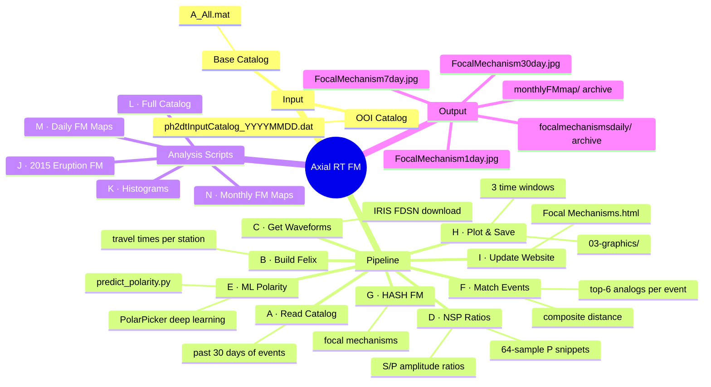
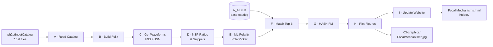

# Axial Seamount Real-Time Focal Mechanisms

Near-real-time focal mechanism estimation for earthquakes at [Axial Seamount](https://en.wikipedia.org/wiki/Axial_Seamount) recorded by the [Ocean Observatories Initiative (OOI)](https://oceanobservatories.org/) cabled array.

**by [Maochuan Zhang](https://www.ocean.washington.edu/home/Maochuan_Zhang)**
5th-year PhD Student, School of Oceanography, University of Washington, Seattle

---

## How It Works

For each recent earthquake, the pipeline finds the **6 most similar historical events** from a base catalog with known focal mechanisms. Similarity is measured by a composite distance combining:
- Hypocenter location
- P-wave first-motion polarities (predicted by a deep learning model)
- S/P amplitude ratios across 7 OOI broadband stations

Focal mechanisms are then inferred via the [HASH algorithm](https://www.usgs.gov/software/hash-hazard-assessment-software-hashrock) using the matched events.

---

## Pipeline Mindmap



---

## Pipeline Flow



---

## Requirements

### MATLAB
- **MATLAB R2023a** at `/Applications/MATLAB_R2023a.app`
- Sibling repositories on your MATLAB path (set by `FM_buildpath6.m`):
  - `Axial-AutoLocate/`
  - `FM/`
  - `AutomaticFM/`

### Python
- Environment: `/opt/miniconda3/envs/FM_RT/bin/python`
- Packages: ObsPy, Keras, scipy, numpy

### Data (not in this repo — too large)
| File | Description |
|------|-------------|
| `02-data/A_All.mat` | Base catalog (~600 MB) with known focal mechanisms |
| `02-data/Event1D_3D_Final.mat` | 2015–2021 FM catalog (`Po_Clu` struct) |

> Contact [Maochuan Zhang](https://www.ocean.washington.edu/home/Maochuan_Zhang) for access to these files.

---

## Setup

**1. Clone the repo**
```bash
git clone https://github.com/maochuan-zhang-UW/Axial_RT_Focal_Mechanisms.git
cd Axial_RT_Focal_Mechanisms
```

**2. Add sibling repos to MATLAB path**

Run once per MATLAB session (or add to `startup.m`):
```matlab
run('FM_buildpath6.m')
```

**3. Place data files** in the `02-data/` folder.

---

## How to Run

### Full daily pipeline (recommended)
Open MATLAB R2023a, navigate to the repo root, then:
```matlab
run('Run_Pipeline_Daily.m')
```

This runs all stages **A → B → C → D → E → F → G → H → I** in sequence and saves output figures to `03-graphics/` and the MAMP website.

---

### Core pipeline stages

| Stage | Script | Input → Output |
|-------|--------|----------------|
| A | `01-scripts/A_read_past1730days.m` | ph2dt catalog → `B_ph2dt.mat` |
| B | `01-scripts/B_polish_ph2dt.m` | `B_ph2dt.mat` → `C_ph2dt.mat` |
| C | `01-scripts/C_getwaveform.m` | `C_ph2dt.mat` → `D_wave.mat` |
| D | `01-scripts/D_SP_wave.m` | `D_wave.mat` → `E_NSP.mat` |
| E | `01-scripts/E_Po.m` | `E_NSP.mat` → `F_DLpol.mat` |
| F | `01-scripts/F_Cl.m` | `F_DLpol.mat` → `F_Cl.mat` |
| G | `01-scripts/G_FM.m` | `F_Cl.mat` → `G_FM.mat` |
| H | `01-scripts/H_Plot_FM.m` | `G_FM.mat` → figures |
| I | `01-scripts/I_UpdateFMWebsite.m` | figures → `Focal Mechanisms.html` |

### Analysis / plot scripts (run independently)

| Script | Description |
|--------|-------------|
| `J_Plot_Eruption2015.m` | FM maps for Before / During / After 2015 eruption |
| `K_Plot_Histograms.m` | FM type histograms |
| `L_Plot_FullCatalog.m` | Full 2015–2021 FM catalog plots |
| `M_Plot_DailyFMmap.m` | Generate daily FM maps → `htdocs/FMmap/` |
| `N_Plot_MonthlyFMmap.m` | Generate monthly FM maps → `htdocs/monthlyFMmap/` (beach ball size scaled by Mw) |

### Python polarity prediction (called by E automatically)
```bash
/opt/miniconda3/envs/FM_RT/bin/python 01-scripts/predict_polarity.py \
    02-data/E_NSP.mat \
    02-data/PolarPicker_unified_TMSF_001.keras \
    02-data/F_DLpol.mat
```

---

## Output

| File | Description |
|------|-------------|
| `03-graphics/FocalMechanism1day.jpg` | Beach ball map — past 24 hours |
| `03-graphics/FocalMechanism7day.jpg` | Beach ball map — past 7 days |
| `03-graphics/FocalMechanism30day.jpg` | Beach ball map — past 30 days |
| `03-graphics/focalmechanismsdaily/FM*day_YYYYMMDD.jpg` | Dated archive per run |
| `htdocs/FMmap/dailyFMmap_YYYYMMDD.jpg` | Daily caldera FM maps |
| `htdocs/monthlyFMmap/monthlyFMmap_YYYYMM.jpg` | Monthly FM maps (Mw-scaled beach balls) |
| `02-data/G_FM.mat` | Focal mechanism solutions (`event1`, `event2`, `event3`) |
| `02-data/F_Cl.mat` | Match results (`Matches`, `Po_Clu`) |

Beach ball color coding: **blue** = Normal · **red** = Reverse · **green** = Strike-slip · **black** = Unclassified

---

## Stations

| FDSN ID | Short | Network |
|---------|-------|---------|
| AXAS1 | AS1 | OO |
| AXAS2 | AS2 | OO |
| AXCC1 | CC1 | OO |
| AXEC1 | EC1 | OO |
| AXEC2 | EC2 | OO |
| AXEC3 | EC3 | OO |
| AXID1 | ID1 | OO |

---

## Website

Results are served locally via MAMP at `http://localhost:8888/` from `/Applications/MAMP/htdocs/`.
The public site is at [axial.ocean.washington.edu](http://axial.ocean.washington.edu).

---

## Citation

If you use this pipeline, please cite:

> Wilcock, W. S. D., M. Tolstoy, F. Waldhauser, C. Garcia, Y. J. Tan, D. R. Bohnenstiehl, J. Caplan-Auerbach, R. P. Dziak, A. Arnulf, & M. E. Mann (2016). Seismic constraints on caldera dynamics from the 2015 Axial Seamount eruption, *Science*, 354, 1395–1399.
